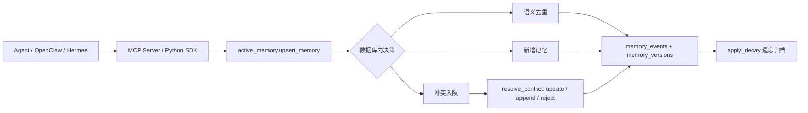

# 🧠 VexDB Active Memory

我把“记忆框架”塞回了数据库里。

结果发现，向量数据库不应该只负责“存”和“搜”，它还应该知道：这条记忆是不是重复、是不是冲突、是不是过期、是不是该被忘掉。

VexDB Active Memory 是一个 **数据库原生智能记忆框架**。它基于 VexDB / openGauss 兼容能力，把语义 UPSERT、冲突裁决、遗忘曲线、多智能体并发控制和审计追踪放进数据库事务层，而不是放在脆弱的 Python 中间件里。

> 一套数据库 = 向量数据库 + 主动记忆管理 + Agent 记忆框架

[English](README_EN.md) · [架构](docs/architecture.md) · [路线图](docs/roadmap.zh.md) · [测试规格](docs/test-specs.zh.md) · [OpenClaw 接入](docs/openclaw.md) · [Hermes 接入](docs/hermes.md) · [MCP 文档](docs/mcp.md)


---

## 30 秒理解

传统记忆框架大多是：

> Agent → Python 记忆中间件 → 向量数据库

问题是，真正决定记忆质量的逻辑不在数据库里：

- 重复记忆越写越多
- 冲突记忆没人裁决
- 过期记忆没人遗忘
- 多 Agent 并发写入容易打架
- 审计链路散在应用层，难以复现

VexDB Active Memory 换了一个方向：

> Agent → MCP / SDK → VexDB 主动记忆内核

数据库不再只是被动存储，而是主动参与记忆管理。



---

## 为什么要做这个？

大模型 Agent 越来越像长期运行的“数字员工”。它们会持续写入用户偏好、业务事实、任务上下文、工具使用经验。

但如果记忆系统只是“向量入库 + 相似度检索”，很快就会出现三类问题：

1. **垃圾记忆**：同一句事实被反复写入，向量库越来越脏。
2. **冲突记忆**：旧偏好和新偏好并存，Agent 不知道该信哪条。
3. **失控记忆**：长期不用的信息不归档、不降权、不遗忘，成本和噪声持续上升。

所以这个项目的核心判断是：

> 记忆不是一张向量表，记忆是一套数据库原生的生命周期管理机制。

---

## 为什么是 VexDB？

VexDB 是兼容 PostgreSQL / openGauss 生态的向量数据库，适合把“向量检索”和“数据库事务能力”放在同一个系统里。

本项目重点使用这些 VexDB 能力：

- `floatvector(1024)` 向量列
- `<=>` 余弦距离检索
- HNSW 向量索引尝试，不支持时自动回退
- SQL schema / function / trigger / index
- ACID 事务
- advisory lock 并发控制
- JSONB 元数据
- PostgreSQL 协议接入
- 可选 PL/Python hook

换句话说，VexDB 不只是“存 embedding 的地方”，它可以成为 Agent 记忆的数据库内核。

---

## 功能全景

### 1. 数据库原生语义 UPSERT

`active_memory.upsert_memory(...)` 在数据库事务内完成写入决策：

- 精确 hash 去重
- 向量近邻语义去重
- 近似但不确定时进入冲突队列
- 新信息正常插入
- 自动写入事件和版本历史

这不是 SDK 里的“先查再写”，而是数据库函数里的原子化写入链路。

### 2. LLM / 人工冲突裁决

`active_memory.resolve_conflict(...)` 支持三种决策：

- `update`：新记忆替换旧记忆
- `append`：新旧记忆都保留
- `reject`：拒绝候选记忆

LLM、人工审核员或策略引擎只负责给出决策，最终修改由数据库函数执行并审计。

### 3. 自动遗忘曲线

`active_memory.apply_decay(...)` 会归档长期未访问、低重要度的记忆。

它解决的是“记忆系统越用越重”的问题：长期不用的记忆不应该永远留在 active 集合里。

### 4. 多智能体并发控制

多 Agent 同时写同一个用户、同一个命名空间、同一个语义事实时，应用层很容易写乱。

本项目使用数据库事务和 advisory lock，把一致性控制下沉到 VexDB。

### 5. 审计与版本历史

核心表：

- `active_memory.memories`
- `active_memory.memory_versions`
- `active_memory.memory_events`
- `active_memory.conflict_queue`
- `active_memory.memory_links`
- `active_memory.policies`

每一次新增、合并、冲突、裁决、归档，都可以被追踪。

### 6. MCP 工具接入

内置 stdio MCP Server，暴露 5 个工具：

- `vexdb_memory_status`
- `vexdb_memory_add`
- `vexdb_memory_search`
- `vexdb_memory_resolve_conflict`
- `vexdb_memory_apply_decay`

OpenClaw、Hermes 或其他 MCP 客户端都可以接入。

---

## 对比一下

| 能力 | 普通向量库 | Python 记忆中间件 | VexDB Active Memory |
| --- | --- | --- | --- |
| 向量检索 | ✅ | ⚠️ 依赖外部库 | ✅ VexDB 原生 |
| 写入去重 | ❌ | ⚠️ 应用层实现 | ✅ 数据库函数 |
| 冲突裁决 | ❌ | ⚠️ 框架内逻辑 | ✅ 队列 + 原子裁决 |
| 自动遗忘 | ❌ | ⚠️ 定制任务 | ✅ 生命周期函数 |
| 多 Agent 并发 | ❌ | ⚠️ 容易竞态 | ✅ 事务 + 锁 |
| 审计追踪 | ❌ | ⚠️ 分散日志 | ✅ 事件表 + 版本表 |
| 框架独立性 | ✅ | ❌ 常绑定框架 | ✅ MCP / SDK 接入 |

核心差异：

> 不是把 VexDB 接到某个记忆框架上，而是让 VexDB 自己成为记忆框架。

---

## 真实验证

当前本地验证结果：

- `python -m pytest tests`：33 passed，1 skipped
- `mcp-smoke`：通过，发现 5 个 MCP 工具
- `smoke-test`：真实 VexDB 入库和检索通过
- `conflict-decay-test`：真实 VexDB 冲突裁决 + 遗忘归档通过
- OpenClaw / Hermes 工具发现已验证

`conflict-decay-test` 返回示例：

```json
{
  "ok": true,
  "resolution": {
    "action": "appended"
  },
  "decay": {
    "archived_count": 1
  },
  "stale_memory_status": "archived",
  "events": {
    "ARCHIVE": 1,
    "RESOLVE": 1
  }
}
```

---

## 快速开始

### 1. 安装

```bash
git clone https://github.com/MiniosZou/vexdb-active-memory.git
cd vexdb-active-memory
python -m pip install -e .[dev]
```

### 2. 配置环境变量

```bash
export VEXDB_DSN='postgresql://vexdb:<url-encoded-password>@127.0.0.1:5432/vastbase'
export VEXDB_MEMORY_EMBEDDING_PROVIDER=mock
```

本地测试可以先用 `mock` embedding。生产环境再切换到 DashScope 等真实 embedding provider。

### 3. 初始化数据库

初始化 schema 通常需要管理员 DSN 或容器内管理员身份：

```bash
PYTHONPATH=python python -m vexdb_active_memory.cli bootstrap --grant-to vexdb
```

如果使用本项目验证过的 VexDB Docker 容器，也可以在容器内用管理员用户执行 SQL，再给应用用户授权。

### 4. 运行验收

```bash
PYTHONPATH=python python -m vexdb_active_memory.cli mcp-smoke
PYTHONPATH=python python -m vexdb_active_memory.cli smoke-test
PYTHONPATH=python python -m vexdb_active_memory.cli conflict-decay-test
python -m pytest tests
```

---

## SDK 示例

```python
from vexdb_active_memory import ActiveMemoryClient

client = ActiveMemoryClient.from_env()

memory_id = client.add(
    "用户出差时优先选择公司协议酒店。",
    namespace="oa",
    scope="user:zouzh",
    memory_type="preference",
)

result = client.search(
    "这个用户有什么酒店偏好？",
    namespace="oa",
    scope="user:zouzh",
)

for memory in result.memories:
    print(memory.id, memory.distance, memory.content)
```

---

## OpenClaw / Hermes 接入

生成 OpenClaw 安装命令：

```bash
PYTHONPATH=python python -m vexdb_active_memory.cli openclaw-install-command \
  --command /mnt/d/codex/vexdb-active-memory/scripts/openclaw-vexdb-memory-mcp.sh
```

生成 Hermes 安装命令：

```bash
PYTHONPATH=python python -m vexdb_active_memory.cli hermes-install-command \
  --command /mnt/d/codex/vexdb-active-memory/scripts/openclaw-vexdb-memory-mcp.sh \
  --env-file ~/.hermes/credentials/vexdb-active-memory.env
```

OpenClaw 中工具名会带 server 前缀，例如：

- `vexdb-active-memory__vexdb_memory_add`
- `vexdb-active-memory__vexdb_memory_search`
- `vexdb-active-memory__vexdb_memory_resolve_conflict`

---

## 宣传话术

### 一句话

> VexDB Active Memory：让向量数据库进化成主动记忆框架。

### 对研发

> 把 Agent 记忆的一致性、去重、冲突裁决、遗忘归档和审计追踪下沉到数据库事务层，减少 Python 中间件里的竞态和状态漂移。

### 对产品

> 从“被动存储”升级到“主动记忆管理”，让智能体长期运行后依然保持轻量、可信、可追踪。

### 对商业

> 一套数据库 = 向量检索 + 记忆治理 + Agent 接入。VexDB 不只是向量库，而是 Agent 记忆基础设施。

### 对比 Mem0 类产品

> Mem0 更像应用层记忆中间件；VexDB Active Memory 的切入点是数据库原生能力，用事务、索引、触发器和 SQL 函数把记忆治理做进数据层。

---

## 路线图

| 版本 | 目标 |
| --- | --- |
| v0.1 | SQL 内核、Python SDK、MCP Server、OpenClaw/Hermes 接入、真实库 smoke/conflict/decay 验证 |
| v0.2 | 性能基线、容器化测试、一键验收环境、升级/回滚策略 |
| v0.3 | 可插拔 LLM 裁决 provider、冲突样本集、准确率报表、人工复核流 |
| v1.0 | 生产 SLO、监控审计、发布包、运维文档 |

详细路线图见 [docs/roadmap.zh.md](docs/roadmap.zh.md)。

---

## Skill

本仓库内置 Codex Skill：

```text
skills/vexdb-active-memory/
```

它可以让 Codex / Hermes 类智能体快速理解本项目的定位、验证命令、宣传口径和排障流程。

安装到本机 Codex：

```text
~/.codex/skills/vexdb-active-memory
```

---

## 目录结构

```text
sql/                         VexDB schema, functions, triggers, indexes
python/vexdb_active_memory/  Python SDK, CLI, and MCP server
docs/                        Architecture, roadmap, integration, verification
skills/                      Reusable Codex skill package
tests/                       Unit, contract, and integration tests
```

---

## 设计边界

- 不依赖 Mem0、MemPalace、LangChain、LlamaIndex 等外部记忆框架。
- OpenClaw、Hermes、Codex 等是接入方，不是记忆能力的拥有者。
- HNSW、PL/Python 是渐进增强，不支持时不能阻断核心链路。
- REST、Web UI、后台 scheduler 暂不属于 v0.1 核心范围。
- 密钥、DSN、API key 不写入仓库。
